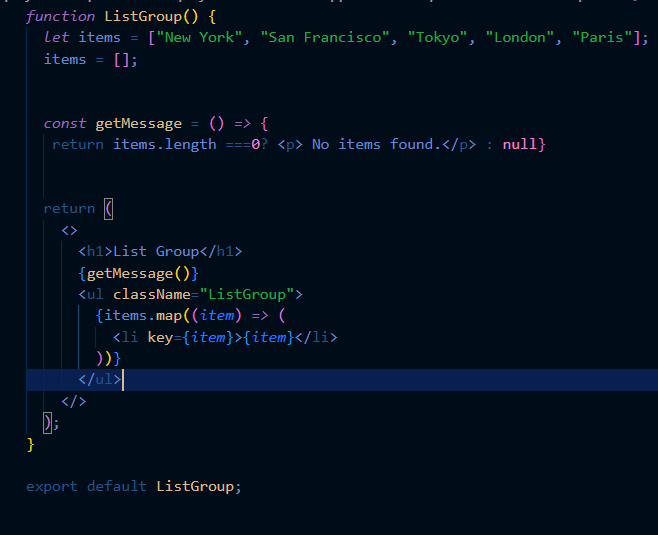
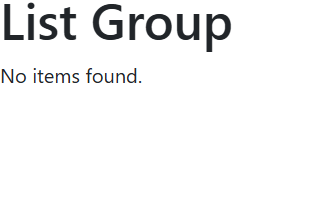

# Entry 4: Picking and Confirming Tool
##### 03/09/2026
---

## Introduction 
For my Freedom Project, I need to learn tools to help me make my website more unique. I had a list of tools to choose from based on difficulty. SEP  is a class where I am not afraid to take on challenges, so I decided to choose a tool with the greatest difficulty,  especially since I know I'm capable of learning it.  I chose [ReactJS](https://react.dev/) because it looks like something I would use for a website, compared to the other tools, and the difficulty wasn’t so low that it would feel boring.  There was also Jekyll as an option, but it didn't look as interesting as ReactJS. This is because it was just making HTML possible by using Markdown. This is also a tool I probably wouldn't really use for other projects I'd be working on, so I took that into account.  After picking my tool,  I decided to play around with it.  With ReactJs, I learned about Bootstrap, and I also learned that it uses TypeScript.  It is very similar to JavaScript but uses HTML to make the coding experience much faster than doing it with only JavaScript. I was following a [YouTube tutorial](https://youtu.be/SqcY0GlETPk?si=GKb8c7VL80we6tI-) by Programming with Mosh that helped me set it up and make it run, and showed me its basics. For Example, using TypeScript and Bootstrap, I learned how to make a list and how the website should respond if the messages are null. 

#### Here is my code: 

#### And here is my result: 

I haven't gone past this, but so far, it was interesting to use. I'm still a little unsure of how to use it but I haven't fully started learning it. So for the next couple weeks, I will continue learning how to use it. 

## EDP

**N/A**

## Skills

#### How to Google
I honestly didn't know how to start while trying to learn how to use ReactJS. I didn't know which tutorials to follow or if I should even use a tutorial. I first started by researching [The ReactJS Website](https://react.dev/), and there it talked about a setup. I downloaded it into my IDE, but then they wanted me to download a formatting program too, and Didn't know which one to choose. So I decided I need to find a tutorial. I looked for the tutorial on YouTube, and the promising one looking was [React Tutorial for Beginners](https://youtu.be/SqcY0GlETPk?si=GKb8c7VL80we6tI-) by Programming with Mosh. He was very straightforward and not only showed how to code but explained how it works, and how it converts HTML into JavaScript, which was pretty cool. All this wouldn't be possible without me trying to Google and search about how to use ReactJS. 

#### Embracing Failure
While following the tutorial, it was a bit confusing, so I had to recheck my work a couple of times to make sure I did it correctly because my work wasn't showing up the way I wanted it to. I also kept messing up the naming rule for JavaScript, where each word had to have a capital letter in functions. I was very unused to that because I was told to make everything lowercase with no spaces. So then my code wouldn't work for that reason either, it is more case sensitive than HTML, I'm pretty sure. But, I had to not get mad and persevere because without mistakes, I won't learn ReactJS. 

 
## Summary 

In Conclusion, the next tool I will be using is ReactJS and learning how to use TypeScript to make an interactive webpage.

[Previous](entry03.md) | [Next](entry05.md)

[Home](../README.md)
