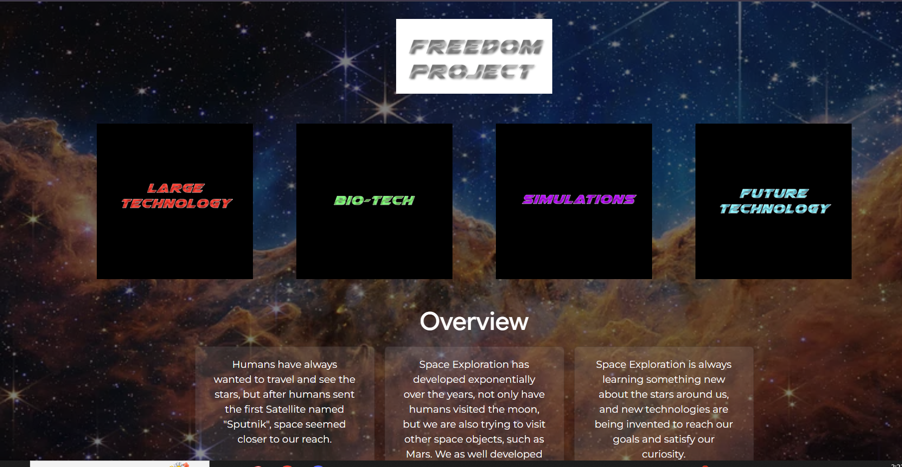

# Entry 5

05/10/26

## Introduction 
To create a website from scratch without a partner was very difficult because I couldn’t split up the work between people. But I was still able to create my minimum viable product. I had a lot of trial and error, especially since GitHub doesn’t work well with ReactJS. To make the wire frame, I originally got inspired by [KiiiKiii's](https://kiiikiii.kr/) website, because they had images, and when you click them, they glow and have a pop-up. I was inspired to make something similar. I eventually made my website link with images, and when you hover over them, they glow, so it was very similar! But displaying the website was very difficult. I searched up so many questions, trying to figure out how to make the website visible on GitHub, and I couldn’t find a clear answer. Eventually, I asked my friend how to fix the issue with my website, and he explained how I needed to add `"homepage": "https://evangelinae1225.github.io/sep10-freedom-project-code/"` to my `package.json` file, and also install `gh-pages` so that the code would work. I also eventually learned that I can’t link JSX files with HTML ones, after some research, so I had to recreate multiple pages in JSX. I had to learn how to import images and give them a name, like a variable, for example, `import bio from './assets/logos/bio-tech.png'`.  Eventually, my website ended up like this: . 

	
	

## EDP

I am on the fifth and sixth steps of the engineering process, where I created a prototype of my website,  tested it, and gained feedback. Some feedback that I received includes changing the opacity of my Cards, making a clearer homepage button, and also fixing my background because on larger screen sizes, you can see where my div’s end. So, on the next step of my EDP, which is improving as needed. I will change the cards' opacity for it to be darker, as well. Instead of making the divs have a darker opacity will make the background itself be darker. I will also at the end of each page about my technology I will add a button for going back to the main page. I will also try centering the buttons on the main screen using Bootstrap classes. 

## Skills

#### Debugging

I have finished my website, but I have spent so many hours debugging it so it appears on GitHub Pages. I needed to change my `package.json` file to make sure it opened at a certain homepage and that all the sites linked together accurately. I also learned that all pages need to be made in React, so I needed to remake all my HTML files, but in ReactJS. I did ask AI for some help with the `package.json` files, specifically because I didn’t know how to write my code there or what I should have put specifically in my situation. But after a while of fixing the issue, my website runs smoothly. I haven’t debugged a website this much the whole time I was in SEP. 

#### Time Management

Many classes have given me homework assignments. I was performing in a musical, and I also had to get ready for the camping trip. I had to plan the time I would do homework, when I would adjust my website, and how much I would be able to add. Unfortunately, I spent a whole period debugging my website and couldn’t gain feedback in class, so I also had to ask people for feedback outside of school hours to be able to improve my website from an outside perspective. So I learned I also should reserve more time for big projects such as this freedom project, more time at home, or the project would feel much more stressful because I would have less time to make a great result. 

## 

##  Summary 

[Previous](entry05.md) | [Next](entry07.md)

[Home](../README.md)
